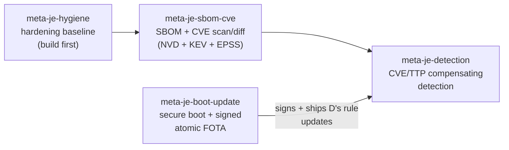
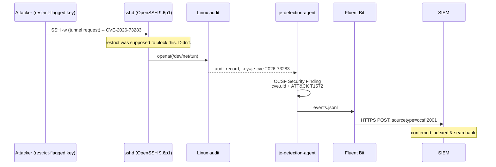
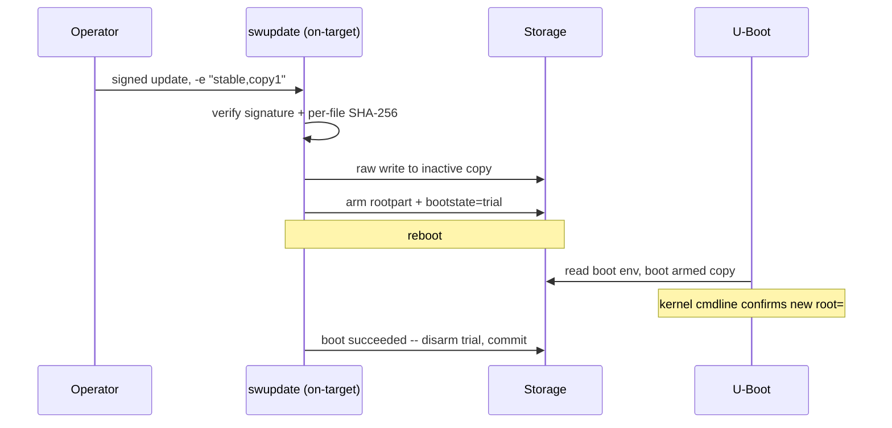

# meta-justembed-security

Open-source Yocto/OpenEmbedded layers that close the **patch-latency
gap**: the weeks between "a CVE is disclosed" and "a rebuilt/updated
image reaches the device" vs. the days it takes an attacker to start
exploiting it. Four independent layers, each adoptable on its own,
each with its own release cadence (same convention as
meta-oe/meta-security/meta-updater -- not a monolith):

- **`meta-je-hygiene`** -- hardening baseline, enforced at `do_rootfs`
  QA time (fails the build if unmet, not just documented).
- **`meta-je-sbom-cve`** -- SBOM (SPDX + CycloneDX) and CVE scan/diff
  (NVD + CISA KEV + EPSS), plus a kernel-CVE triage pipeline that
  resolves version-range-matching noise a normal scan can't.
- **`meta-je-detection`** -- turns a CVE into a compensating detection
  rule (OCSF `Security Finding` + auditd rule today, Falco/eBPF later),
  shipped independently of firmware on its own faster cadence, over
  its own signed, no-reboot update channel.
- **`meta-je-boot-update`** -- secure boot (U-Boot verified boot) and
  atomic FOTA (swupdate-based signed A/B firmware updates, plus
  independent signed rule-bundle updates for `meta-je-detection`).

Licensed Apache-2.0 + NOTICE (see `LICENSE`/`NOTICE`) -- patent grant,
attribution, no copyleft. Contribution standard: `CONTRIBUTING.md`.
Vulnerability reports: `SECURITY.md`.

## Hardware & platform requirements

These layers target any Yocto/OpenEmbedded-built embedded Linux
image, not a specific board or SoC:

- **`meta-je-hygiene`** -- any systemd-based image. The kernel-
  hardening-flags check needs a standard Kconfig-based kernel (true
  for effectively any Yocto BSP).
- **`meta-je-sbom-cve`** -- any target with a normal Yocto kernel/
  bootloader recipe. The source-level triage pipeline (kernel/u-boot
  CVE noise reduction) needs the build to retain a real git checkout
  and `.config` for the package being triaged -- true by default for
  most kernel/bootloader recipes.
- **`meta-je-detection`** -- a kernel built with `CONFIG_AUDIT=y` +
  `CONFIG_AUDITSYSCALL=y`, systemd, and Python 3. Any individual
  detection rule may need its own kernel feature (the sample rule
  below needs `CONFIG_TUN=y`) -- that's a property of the rule, not
  the layer.
- **`meta-je-boot-update`** -- `je-swupdate-fota` needs an A/B-style
  partition layout compatible with swupdate's raw-write mode.
  `je-secureboot` needs a U-Boot build with FIT signature support
  (`CONFIG_FIT`, `CONFIG_FIT_SIGNATURE`, `CONFIG_RSA`,
  `CONFIG_OF_SEPARATE`). On SoCs whose boot ROM doesn't cryptographically
  verify the first-stage bootloader (common on general-purpose, as
  opposed to security-oriented, silicon tiers across most vendors),
  the verified chain can only start *at* U-Boot -- FIT-signed
  kernel/DT/rootfs, not a ROM-anchored chain. That's a property of the
  silicon tier, not a limitation of this layer.

## What's demonstrated today

`meta-je-detection` has been proven end to end on physical hardware
against a real, disclosed CVE, not simulated:

A `restrict`-flagged SSH key genuinely established tunnel forwarding
against a real `sshd` on real hardware -- the audit rule fired on the
real syscall, the agent emitted a real OCSF event
(`vulnerabilities[].cve.uid` = `CVE-2026-73283`,
`attacks[].technique` = `T1572` "Protocol Tunneling"), Fluent Bit
shipped it, it landed indexed and searchable downstream. See
`meta-je-detection/README.md` for the full mechanism.

`meta-je-sbom-cve`'s kernel-CVE triage resolves roughly a tenth of a
typical kernel CVE scan's noise automatically (config-inapplicable
code paths, confirmed-fixed backports, CPE mismatches), each with
cited evidence -- not a guess, never auto-written to a recipe. See
`meta-je-sbom-cve/README.md`.

`meta-je-boot-update`'s FOTA mechanism has been demonstrated on real
hardware: a signed update written to both A/B copies, each with a
real reboot and a real trial-boot commit --

-- plus a second, independent signed update that ships just
`meta-je-detection`'s rule-bundle content with no reboot, hot-reloading
`auditd` and the detection agent in place. See
`meta-je-boot-update/README.md`.

## Getting started (with AI)

Adding these layers to a new BSP target is a short, concrete sequence
-- not a research problem. An implementer (human or an AI coding
agent) can follow this directly:

1. **Add the kas dependency** -- real `url:`/`branch:`, `layers:` naming
   whichever of `meta-je-hygiene` / `meta-je-sbom-cve` /
   `meta-je-detection` you're adopting.
2. **`meta-je-detection` only** -- add two kernel config fragments via
   a `.bbappend` on your kernel recipe: `CONFIG_AUDIT=y` +
   `CONFIG_AUDITSYSCALL=y` (always), plus whichever kernel feature the
   specific CVE rule you're using needs (e.g. `CONFIG_TUN=y` for the
   sample tunnel-forwarding rule) -- check per rule, per target, don't
   assume.
3. **Set `RDEPENDS`/service exec paths exactly** as documented -- two
   package names and one binary path that look right but aren't
   (`auditd` not `audit`, `python3-modules` not a single stdlib split
   package, `/usr/bin/td-agent-bit` not `/usr/bin/fluent-bit`).
4. **Build and deploy.**
5. **Validate on real hardware** -- confirm every service is actually
   `active (running)` (not just `enabled`), the audit rule is loaded,
   and triggering the real condition produces a real event that
   actually lands wherever it's shipped to. A clean build proves the
   recipe is well-formed; it proves nothing about whether the layer
   works.

Full detail, exact commands, and the reasoning behind each gotcha:
`.claude/skills/meta-je-bootstrap/SKILL.md`. It ships with the layers
so it travels to any adopter -- to activate it in a *consuming*
project, copy or symlink the skill directory into that project's own
`.claude/skills/` (Claude Code only discovers skills relative to the
working directory it's invoked in, not across repos).

## Built on

These layers integrate existing, proven open-source components around
real product constraints, rather than reinventing them:

- [The Yocto Project / OpenEmbedded](https://www.yoctoproject.org/) --
  the build system and layer model this project itself follows.
- [meta-swupdate](https://github.com/sbabic/meta-swupdate) --
  `je-swupdate-fota`'s update mechanism.
- OpenEmbedded-core's own `create-spdx`, `cve-check`,
  `kernel-fitimage`, and `uboot-sign` classes -- SBOM generation, CVE
  scanning, and FIT signing, wired up rather than rebuilt.
- [Linux audit](https://github.com/linux-audit/audit-userspace)
  (`auditd`) -- the detection engine `meta-je-detection` builds on.
- [Fluent Bit](https://fluentbit.io/) -- event shipping.
- [OCSF](https://schema.ocsf.io/) (Open Cybersecurity Schema
  Framework) -- the event format detection findings are emitted in.
- [CISA's Known Exploited Vulnerabilities
  catalog](https://www.cisa.gov/known-exploited-vulnerabilities-catalog)
  and [FIRST.org's EPSS](https://www.first.org/epss/) -- real-world
  exploitation signal for CVE prioritization.
