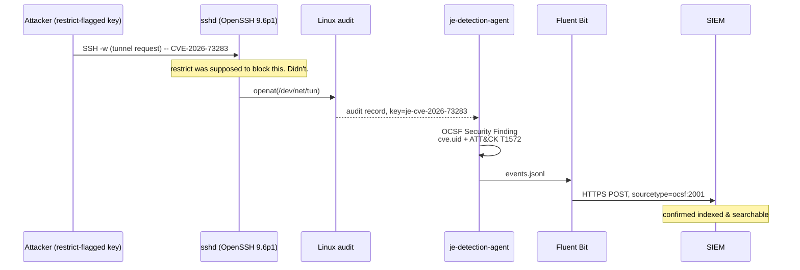
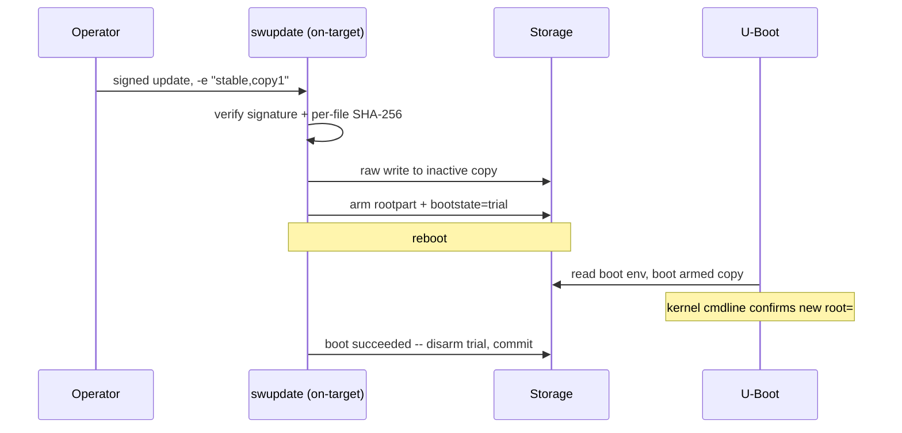

# meta-justembed-security

Reusable open-source Yocto/OpenEmbedded building blocks for practical
embedded Linux security. Four independent layers that close the
**patch-latency gap** -- the weeks between "a CVE is disclosed" and "a
rebuilt/updated image reaches the device" vs. the days it takes an
attacker to start exploiting it -- each adoptable on its own, each with
its own release cadence (same convention as
meta-oe/meta-security/meta-updater, not a monolith).

`Hygiene -> Evidence -> Detect -> Update & Boot`

See `PROJECT.md` for the full project definition (problem, target
users, design principles, non-goals, maturity model) and `ROADMAP.md`
for what's next. This file is the entry point; those two are the
guardrails.

## Why this exists

Embedded Linux security work is usually split into disconnected
activities: hardening a rootfs at build time, generating an SBOM,
scanning for CVEs, watching for runtime misuse, shipping an update.
Each of those exists as mature open-source tooling already. What's
often missing on a real product is the connection between them -- a
CVE found in a scan doesn't automatically become something the device
can detect at runtime, and a detection rule doesn't automatically ship
without waiting for the next full firmware release. This project wires
existing upstream tooling (`cve-check`, `create-spdx`,
`kernel-fitimage`, `uboot-sign`, `meta-swupdate`, Linux audit, Fluent
Bit, OCSF) into that lifecycle, rather than replacing any of it.

## Building blocks

| Building block | Layer | Main purpose | Current maturity |
|---|---|---|---|
| Hygiene | `meta-je-hygiene` | Hardening baseline, enforced at `do_rootfs` QA time (fails the build if unmet, not just documented). | Hardware-verified: an unmet enforced check correctly fails a real build on physical hardware. |
| Evidence | `meta-je-sbom-cve` | SBOM (SPDX) and CVE scan/diff (NVD + CISA KEV + EPSS), plus a kernel-CVE triage pipeline that resolves version-range-matching noise a normal scan can't. | Demonstrated end to end on QEMU, including a real scan-to-scan diff and real KEV/EPSS triage -- see `docs/evidence/`. |
| Detect | `meta-je-detection` | Turns a CVE into a compensating detection rule (OCSF Security Finding + auditd rule today), shipped independently of firmware on its own faster cadence over a signed, no-reboot update channel. | Hardware-verified against one real, disclosed CVE (CVE-2026-73283) -- one proven rule, not a general detection-coverage claim. |
| Update & Boot | `meta-je-boot-update` | Verified boot (U-Boot FIT signing) and atomic FOTA (swupdate-based signed A/B firmware updates, plus independent signed rule-bundle updates for `meta-je-detection`). | FOTA hardware-verified (real hardware, both A/B directions, real reboot). Secure boot demonstrated end to end (including rollback) on QEMU; hardware boot-to-login not yet demonstrated -- see `meta-je-boot-update/README.md`. |

Maturity terms follow `PROJECT.md`'s maturity model. See
`docs/evidence/` for the reproducible record behind each QEMU-based
claim in this table.

## Design principles

- Composable, not monolithic -- each layer is independently adoptable.
- Use mature upstream projects instead of reinventing them.
- No mandatory cloud/backend dependency.
- Evidence over unsupported claims.
- Preserve uncertainty in vulnerability analysis -- ambiguous CVE
  triage goes to a human reviewer, never silently resolved.
- Integration with existing security infrastructure (collector/SIEM,
  update server) rather than shipping a new backend.
- Independently adoptable layers.

Full detail: `PROJECT.md`.

## Current scope

Embedded Linux and IoT products built with Yocto/OpenEmbedded --
industrial embedded devices and Linux-based HMIs/gateways where normal
Linux integration is appropriate. See "OT roadmap" below for where
this is headed next, and `PROJECT.md`/`ROADMAP.md` for the full
picture.

## Non-goals

- Not a CRA (EU Cyber Resilience Act) compliance product -- it does not
  by itself establish regulatory compliance.
- Not a SIEM.
- Not a fleet-management backend.
- Not a plant-wide OT security system.
- Not a Safety Instrumented System (SIS) runtime security platform.
- Not a replacement for product-specific threat modeling or risk
  assessment.
- Not a certification framework (e.g. IEC 62443).

## Hardware & platform requirements

These layers target any Yocto/OpenEmbedded-built embedded Linux image,
not a specific board or SoC:

- **`meta-je-hygiene`** -- any systemd-based image. The kernel-
  hardening-flags check needs a standard Kconfig-based kernel (true
  for effectively any Yocto BSP).
- **`meta-je-sbom-cve`** -- any target with a normal Yocto kernel/
  bootloader recipe. The source-level triage pipeline (kernel/u-boot
  CVE noise reduction) needs the build to retain a real git checkout
  and `.config` for the package being triaged -- true by default for
  most kernel/bootloader recipes.
- **`meta-je-detection`** -- a kernel built with `CONFIG_AUDIT=y` +
  `CONFIG_AUDITSYSCALL=y`, systemd, and Python 3. Any individual
  detection rule may need its own kernel feature (the sample rule
  below needs `CONFIG_TUN=y`) -- that's a property of the rule, not
  the layer.
- **`meta-je-boot-update`** -- `je-swupdate-fota` needs an A/B-style
  partition layout compatible with swupdate's raw-write mode.
  `je-secureboot` needs a U-Boot build with FIT signature support
  (`CONFIG_FIT`, `CONFIG_FIT_SIGNATURE`, `CONFIG_RSA`,
  `CONFIG_OF_SEPARATE`). On SoCs whose boot ROM doesn't cryptographically
  verify the first-stage bootloader (common on general-purpose, as
  opposed to security-oriented, silicon tiers across most vendors),
  the verified chain can only start *at* U-Boot -- FIT-signed
  kernel/DT/rootfs, not a ROM-anchored chain. That's a property of the
  silicon tier, not a limitation of this layer. See
  `meta-je-boot-update/README.md` for exactly where the verified chain
  starts in the current reference implementation.

## What's demonstrated today

`meta-je-detection` has been proven end to end on physical hardware
against a real, disclosed CVE, not simulated:

A `restrict`-flagged SSH key genuinely established tunnel forwarding
against a real `sshd` on real hardware -- the audit rule fired on the
real syscall, the agent emitted a real OCSF event
(`vulnerabilities[].cve.uid` = `CVE-2026-73283`,
`attacks[].technique` = `T1572` "Protocol Tunneling"), Fluent Bit
shipped it, it landed indexed and searchable downstream. See
`meta-je-detection/README.md` for the full mechanism.

`meta-je-sbom-cve`'s kernel-CVE triage resolves roughly a tenth of a
typical kernel CVE scan's noise automatically (config-inapplicable
code paths, confirmed-fixed backports, CPE mismatches), each with
cited evidence -- not a guess, never auto-written to a recipe. See
`meta-je-sbom-cve/README.md`.

`meta-je-boot-update`'s FOTA mechanism has been demonstrated on real
hardware: a signed update written to both A/B copies, each with a
real reboot and a real trial-boot commit --

-- plus a second, independent signed update that ships just
`meta-je-detection`'s rule-bundle content with no reboot, hot-reloading
`auditd` and the detection agent in place. See
`meta-je-boot-update/README.md`.

`meta-je-boot-update`'s secure boot mechanism (FIT signing, U-Boot
verification) has separately been demonstrated end to end on QEMU,
including rejecting a tampered image and a full A/B FOTA cycle proven
in both directions (commit and rollback) -- see "Reference
implementation" and `docs/evidence/` below.

## Reference implementation

This repository is the reusable mechanisms. It doesn't build a bootable
image by itself.
[`meta-je-example-bsp`](https://github.com/justembed-labs/meta-je-example-bsp)
is a separate, QEMU-based worked example that adds all four layers to
a real `core-image-minimal` build and demonstrates them running --
including the secure-boot and FOTA end-to-end proofs referenced above.

The QEMU proofs there are real (a real signature check, a real signed
update, a real revert) but they run on QEMU's generic `virt` machine,
not a hardware root of trust. They demonstrate the mechanisms
correctly; they are not equivalent to hardware assurance on a specific
product's own SoC. Where this project has separately been verified on
real hardware (see the maturity table above), that's called out
explicitly in the relevant layer's own README.

## Evidence

`docs/evidence/` holds reproducible records -- exact commands, exact
output -- for the claims in this README and in each layer's own
README that can currently be reproduced by an outside reader (mostly
via `meta-je-example-bsp`, which requires nothing but QEMU). Claims
verified only on physical hardware are marked as such in the index
there; reproducing those independently needs the same hardware, which
this project doesn't yet publish access to.

## Getting started (with AI)

Adding these layers to a new BSP target is a short, concrete sequence
-- not a research problem. An implementer (human or an AI coding
agent) can follow this directly:

1. **Add the kas dependency** -- real `url:`/`branch:`, `layers:` naming
   whichever of `meta-je-hygiene` / `meta-je-sbom-cve` /
   `meta-je-detection` you're adopting.
2. **`meta-je-detection` only** -- add two kernel config fragments via
   a `.bbappend` on your kernel recipe: `CONFIG_AUDIT=y` +
   `CONFIG_AUDITSYSCALL=y` (always), plus whichever kernel feature the
   specific CVE rule you're using needs (e.g. `CONFIG_TUN=y` for the
   sample tunnel-forwarding rule) -- check per rule, per target, don't
   assume.
3. **Set `RDEPENDS`/service exec paths exactly** as documented -- two
   package names and one binary path that look right but aren't
   (`auditd` not `audit`, `python3-modules` not a single stdlib split
   package, `/usr/bin/td-agent-bit` not `/usr/bin/fluent-bit`).
4. **Build and deploy.**
5. **Validate on real hardware** -- confirm every service is actually
   `active (running)` (not just `enabled`), the audit rule is loaded,
   and triggering the real condition produces a real event that
   actually lands wherever it's shipped to. A clean build proves the
   recipe is well-formed; it proves nothing about whether the layer
   works.

This project has been built and run against Yocto **scarthgap**;
other releases haven't been tested and aren't claimed to work.

Full detail, exact commands, and the reasoning behind each gotcha:
`.claude/skills/meta-je-bootstrap/SKILL.md`. It ships with the layers
so it travels to any adopter -- to activate it in a *consuming*
project, copy or symlink the skill directory into that project's own
`.claude/skills/` (Claude Code only discovers skills relative to the
working directory it's invoked in, not across repos).

For a from-scratch, no-hardware walkthrough, start from
`meta-je-example-bsp` instead -- it's a complete, working `kas.yml`
you can build directly.

## CRA relevance

This project can provide technical building blocks and evidence
relevant to product cybersecurity and vulnerability-handling
activities under frameworks such as the EU Cyber Resilience Act. It
does not by itself establish regulatory compliance -- see
`meta-je-hygiene/README.md` and `meta-je-boot-update/README.md` for
the specific, narrower technical connections each layer draws, and
`PROJECT.md`'s Non-goals.

## OT roadmap

Current engineering focus is embedded Linux and IoT. Constrained
industrial HMI/gateway deployment, offline operation, bounded resource
use, and IEC 62443-aware deployment models are roadmap areas -- not
current capabilities. See `ROADMAP.md`.

## Contributing

See `CONTRIBUTING.md`.

## Vulnerability reporting

See `SECURITY.md` -- don't open a public issue.

## License and upstream attribution

Licensed Apache-2.0 + NOTICE (see `LICENSE`/`NOTICE`) -- patent grant,
attribution, no copyleft. This project integrates existing open-source
components rather than replacing them; their own licenses and
copyright are unaffected and retained.

## Built on

- [The Yocto Project / OpenEmbedded](https://www.yoctoproject.org/) --
  the build system and layer model this project itself follows.
- [meta-swupdate](https://github.com/sbabic/meta-swupdate) --
  `je-swupdate-fota`'s update mechanism.
- OpenEmbedded-core's own `create-spdx`, `cve-check`,
  `kernel-fitimage`, and `uboot-sign` classes -- SBOM generation, CVE
  scanning, and FIT signing, wired up rather than rebuilt.
- [Das U-Boot](https://www.denx.de/wiki/U-Boot) -- the bootloader
  `je-secureboot`'s FIT verification chain builds on.
- [QEMU](https://www.qemu.org/) -- lets the worked example run and be
  reproduced by anyone, on any machine, with no physical hardware
  required.
- [systemd](https://systemd.io/) -- the service model `meta-je-hygiene`'s
  service-surface check and `meta-je-detection`'s own units are built
  around.
- [Linux audit](https://github.com/linux-audit/audit-userspace)
  (`auditd`) -- the detection engine `meta-je-detection` builds on.
- [Fluent Bit](https://fluentbit.io/) -- event shipping.
- [OCSF](https://schema.ocsf.io/) (Open Cybersecurity Schema
  Framework) -- the event format detection findings are emitted in.
- [CISA's Known Exploited Vulnerabilities
  catalog](https://www.cisa.gov/known-exploited-vulnerabilities-catalog)
  and [FIRST.org's EPSS](https://www.first.org/epss/) -- real-world
  exploitation signal for CVE prioritization.
